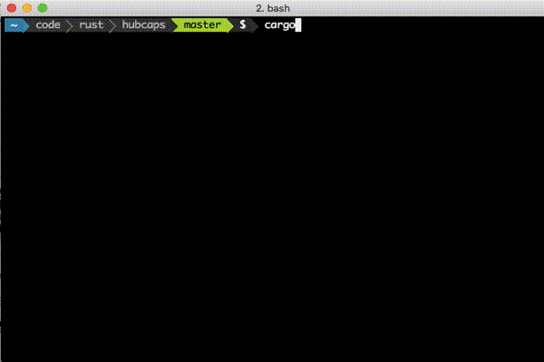

# cargo thanks

Give thanks (in the form of [github stars](https://help.github.com/articles/about-stars/)) to your fellow Rustaceans



## Install

This is intended to be installed as a [cargo](http://doc.crates.io/index.html) plugin

```bash
$ cargo install --force cargo-thanks
```

(adding the `--force` upgrades to the latest version when installing)

### usage

Create a [github access token](https://github.com/settings/tokens) with the "public_repo" permission and
store its value in an env variable named `GITHUB_TOKEN`

Within any of your Cargo based Rust projects, run the following

```bash
$ cargo thanks
```

This will find all of your Cargo dependencies, find their github.com repository from metadata hosted on crates.io, and star their github repositories. This was
inspired in part by medium's clapping button as a way to show thanks for someone elses work you've found enjoyment in.

Doug Tangren (softprops) 2017
